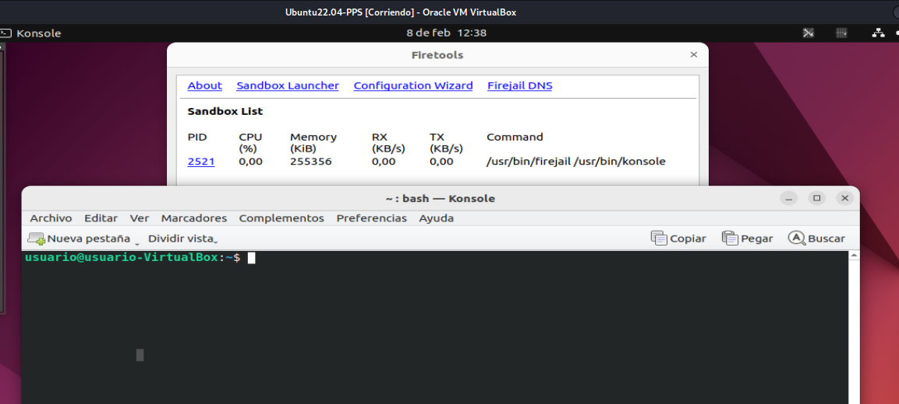
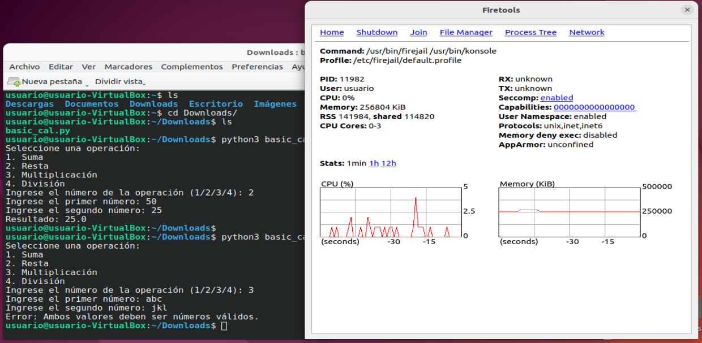
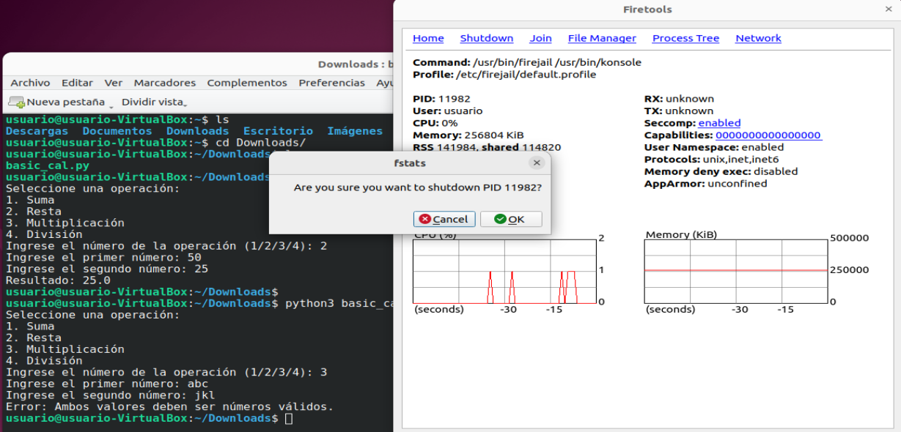

# PPS-Unidad1-Actividad4-JcMartin
## Actividad 4 Unidad 1 Prueba de aplicaciones en entorno controlado: Sandbox

En esta actividad vamos a trabajar sobre la prueba de aplicaciones en entornos controlados: sandboxex o cajas de arena.

Puedes ver en qué consiste y diferentes alternativas en el siguiente artículo:

La actividad consiste en probar la aplicación de la calculadora, que has realizado en una actividad anterior, en un entorno controlado.
> (Si no la tienes terminada, puedes usar la que tienes  en la tarea)

---
## Pruebas
---
> -    Busca cuáles son las distintas alternativas que tienes para probar esta aplicación en una Sandbox.
> -    Crea el entorno controlado y prueba la aplicación en él.
> -    Documenta cómo has desarrollado el proyecto en github.
---

## Alternativas en Sandbox

> Sobre la implementación de la aplicación de la calculadora en Python de la actividad anterior:
> - Texto.

## Entorno controlado en Sandbox

> - - Descargamos e instalamos Python3 por consola en Ubuntu 22.04.

> - - Descargamos e instalamos por consola el Sandbox "Firejail".
Para instalar el sandbox y usarlo exclusivamente a través de la terminal tenemos que ejecutar el siguiente comando en la terminal:

    sudo apt-get install firejail

Si además queremos disponer de una interfaz gráfica para gestionar nuestro sandbox ejecutaremos el siguiente comando en la terminal:

    sudo apt-get install firetools

> - - Iniciamos Firejail Sandbox desde el gestor de programas de ubuntu o desde la consola escribiendo "firejail".

> - - Debemos marcar el check box para antes de hacer clic en aceptar/siguiente, para que se realicen las pruebas.

> - - Al aceptar se abre una ventana de comandos konsole y otra que muestra el pid del proceso y una serie de menús en firejail.

> - - La ventana de comandos ya se encuentra en el entorno sandbox. Navegamos hasta el directorio donde se encuentra el archivo.

`cd /home/usuario/Downloads/ && python3 basic_cal.py`

> - - Podemos navegar por los difentes menús que ofrece firejail y comprobar parámetros, como memoria y directorios.

> - - Para salir simplemente matamos el proceso desde el menú "Shutdown" - terminar proceso.

## Enlaces de interés

## ENTREGA

>__En la plataforma: pega el enlace y y sube el repositorio comprimido.__

