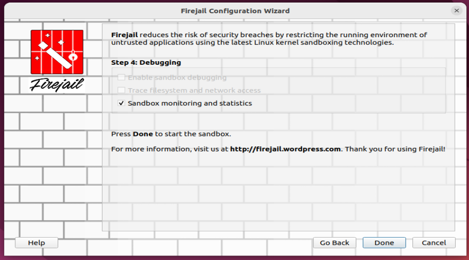

# PPS-Unidad1-Actividad4-JcMartin
Actividad 4 Unidad 1 Prueba de aplicaciones en entorno controlado: Sandbox

En esta actividad vamos a trabajar sobre la prueba de aplicaciones en entornos controlados: sandboxex o cajas de arena.

Puedes ver en qué consiste y diferentes alternativas en el siguiente artículo:

La actividad consiste en probar la aplicación de la calculadora, que has realizado en una actividad anterior, en un entorno controlado.
> (Si no la tienes terminada, puedes usar la que tienes adjunta en la tarea)

---
## Pruebas
---
    Busca cuáles son las distintas alternativas que tienes para probar esta aplicación en una Sandbox.
    Crea el entorno controlado y prueba la aplicación en él.
    Documenta cómo has desarrollado el proyecto en github.
---

## Alternativas en Sandbox

> Sobre la implementación de la aplicación de la calculadora en Python de la actividad anterior:
> - Texto.

## Entorno controlado en Sandbox

> - - texto.

> - - Texto.

> - - Texto.

> - - texto.

> - - texto.

> - - texto.

## ENTREGA

>__En la plataforma: pega el enlace y y sube el repositorio comprimido.__

